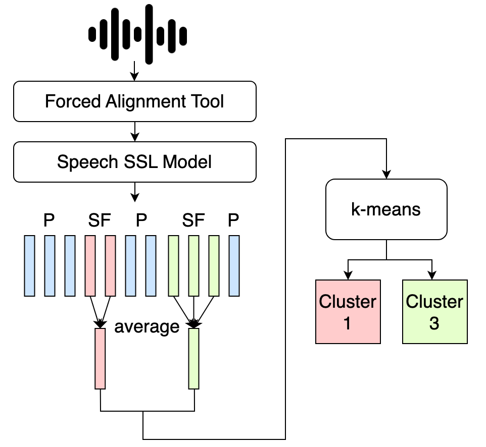

## Unsupervised-SponTTS

* This is a PyTorch implementation of my master thesis: *Spontaneous Chinese Speech Synthesis by Unsupervised Learning.*

<p align="center">
    <br>
    
    <br>
</p>

## Spontaneous Feature Extraction
* In this work, we use [MFA(Montreal Forced Alignment)](https://github.com/MontrealCorpusTools/Montreal-Forced-Aligner) to find the spontaneous feature in speech.
* After we find the spontaneous feature in speech, cluster these feature by Automatic Classification System. The implementation can be refered to [cluster.ipynb](https://colab.research.google.com/drive/1-eiyRbju-Y7PgfxpHDLlMigGBH1lJZUZ?usp=sharing).

## Steps
1. preprocess.py
2. train.py
3. synthesize.py

## 1. Preprocess
### File Structures:

[DATASET] / wavs / speaker / wav_files
[DATASET] / txts / speaker / txt_files

* wav_dir : the folder containing speaker dirs  ( [DATASET] / wavs )
* txt_dir : the folder containing speaker dirs ( [DATASET] / txts )
* save_dir : the output directory (e.g. "./processed" )
* -\-prepare_mfa : create mfa_data
* -\-mfa : create textgrid files
* -\-create_dataset : generate mel, phone, f0 ....., metadata.json

### Example commands:
* LJSpeech:
``` shell
python ./script/organizeLJ.py

python preprocess.py /storage/tts2021/LJSpeech-organized/wavs /storage/tts2021/LJSpeech-organized/txts ./processed/LJSpeech --prepare_mfa --mfa --create_dataset
```

## 2. Train
* data_dir : the preprocessed data directory
* -\-record_dir: the output directory
* -\-unk_cls: the number of clusters.

### Example commands:
``` shell
python train.py /content/processed_data --record_dir /content/drive/Shareddrives/Lab/ChenNing/records --unk_cls 50
```

## 3. Synthesize
* -\-ckpt_path: the checkpoint path
* -\-output_dir: the directory to put the synthesized audios

### Example commands:
``` shell
python synthesize.py --ckpt_path [ckpt_path] --output_dir ./output
```


## References 
- [FastSpeech 2: Fast and High-Quality End-to-End Text to Speech](https://arxiv.org/abs/2006.04558), Y. Ren, *et al*.
- [FastSpeech: Fast, Robust and Controllable Text to Speech](https://arxiv.org/abs/1905.09263), Y. Ren, *et al*.
- [AdaSpeech 3: Adaptive Text to Speech for Spontaneous Style](https://arxiv.org/abs/2107.02530), Y. Yan, *et al*.
- [SponTTS: modeling and transferring spontaneous style for TTS](https://arxiv.org/abs/2311.07179), H. Li, *et al*
- [rishikksh20's FastSpeech2 implementation](https://github.com/rishikksh20/FastSpeech2)
- [Ming024's FastSpeech2 implementation](https://github.com/ming024/FastSpeech2)